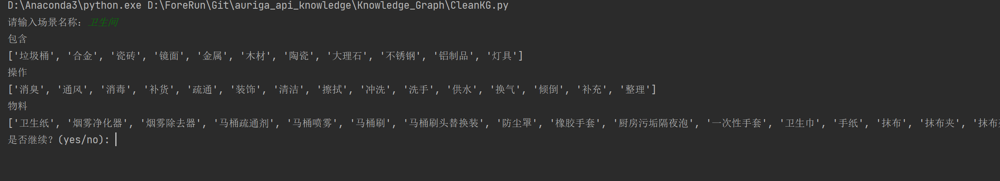
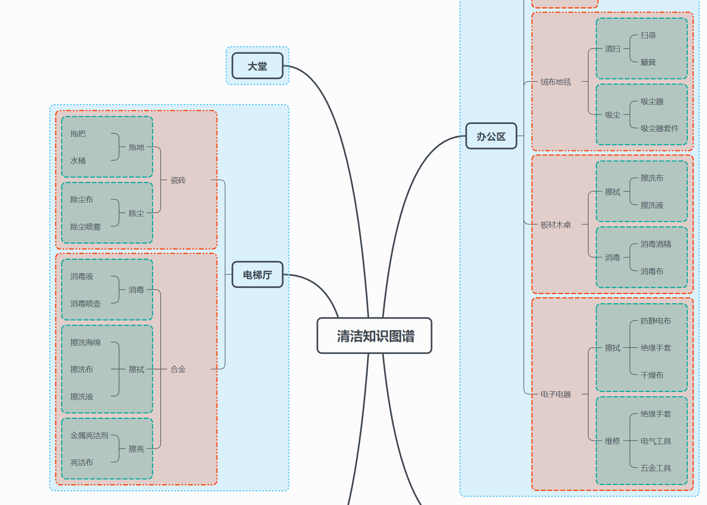

# auriga_api_knowledge 智辂知识图谱API
## Introduction
- Knowledge_Data文件为爬取到的所有数据，数据文件在.data文件夹下，py程序是使所有数据能够连接到neo4j数据库。
- Knowledge_Graph文件中包含建立了所有关系的数据文件.csv文件，py文件用于输入场景，能够输出该场景关联的材质、操作和配件。
- Gantt_Graph文件为实现清洁人员和操作排班的一个demo，构成了工艺卡以及工艺流程的与时间相关部分的内容。
- 清洁配置.xmind文件是知识图谱下一阶段工作的思维导图。以嵌套方式构建子图谱。.xmind文件用xmind软件打开。
## Installation
(以下只针对Knowledge_Data和Knowledge_Graph文件，Gantt_Graph可以直接运行)
1. 安装neo4j 
   1. 下载neo4j-community-3.x.x-windows和jdk-11.0.2_windows-x64_bin 
   2. neo4j解压即可，jdk就常规安装 
   3. 完成之后需要将neo4j和jdk的bin目录都配置为环境变量（即path中，若不懂请自行百度）
2. pip install py2neo
3. cmd下启动Neo4j 
   1. neo4j.bat console 
   2. 访问http://localhost:7474/
   3. 用户名和密码都输入neo4j，并连接（注意命令行窗口不能关闭），之后重新设置密码（建议设置为123456） 
4. 在.py文件中更改地址、账户和密码，运行文件(CleanKG.py的51行，Knowledge_Data.py的91行)
5. 运行.py程序，网页就能以图形化界面显示库文件及关系,如图。

1. 在CleanKG.py的终端可以输入场景名称，会返回相关数据，如图。

## 知识图谱下一阶段构建的思路
1. 知识图谱目前由四种类别构成：场景、对象、操作、配件；此外还涉及到对象、操作和配件的重复。 也就是说，不同场景下可能包含同样的对象，造成了对象的操作和配件有差异。
2. 因此，可以采用嵌套的方式构建联系。这里的嵌套不仅仅指的是场景-对象-操作-配件之间层级递进的联系。
3. 由于知识图谱本质是以节点和关系构成的，以嵌套形式，将每段关系看作一个子图谱。如图。

1. 例如：电梯厅中的对合金材质对象执行消毒操作，将消毒操作和消毒液、消毒喷壶作为一个子图谱，属于电梯厅的合金材质对象。而可以看到办公区的板材木桌也有一个消毒操作的子图谱。但这只是名称相同，而内部包含关系不同的子图谱。
2. 逻辑：在场景层，不存在名称重复的子图谱，即不存在两个叫电梯厅的子图谱。但在不同场景层的子图谱中可能存在对象材质重复但包含关系不同的子图谱。但在单个场景层中不允许出现重复的对象材质。